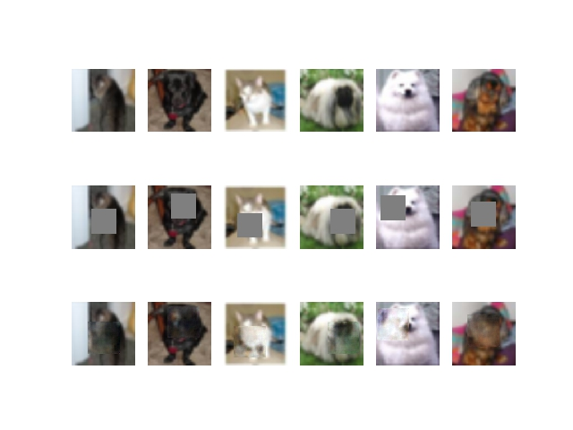
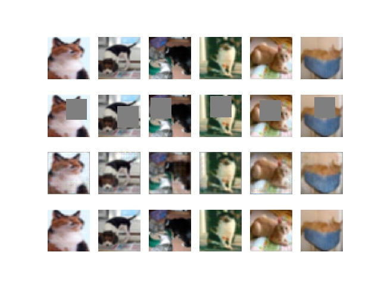

# Context Encoder
Based on Context Encoders: Feature Learning by Inpainting [1]
and Semi-Supervised Learning with Context-Conditional Generative Adversarial Networks [2]

## Requirements
all environment settings are stored in *requirements.txt*

## Summary
This project trains a model to predict a square patch lost of data inside an image.
To execute the training the following code should be run.
```python
python context.py
```
**Example**




```python
python ccgan.py
```
**Example**



**NOTE:** For the generator a low resolution image is concatenated within the network

This project uses CIFAR10 data with only *cats and dogs* to reduce number of samples.

# References
[1] [Context Encoders: Feature Learning by Inpainting](https://people.eecs.berkeley.edu/~pathak/papers/cvpr16.pdf)

[2] [Semi-Supervised Learning with Context-Conditional Generative Adversarial Networks](https://arxiv.org/abs/1611.06430)
